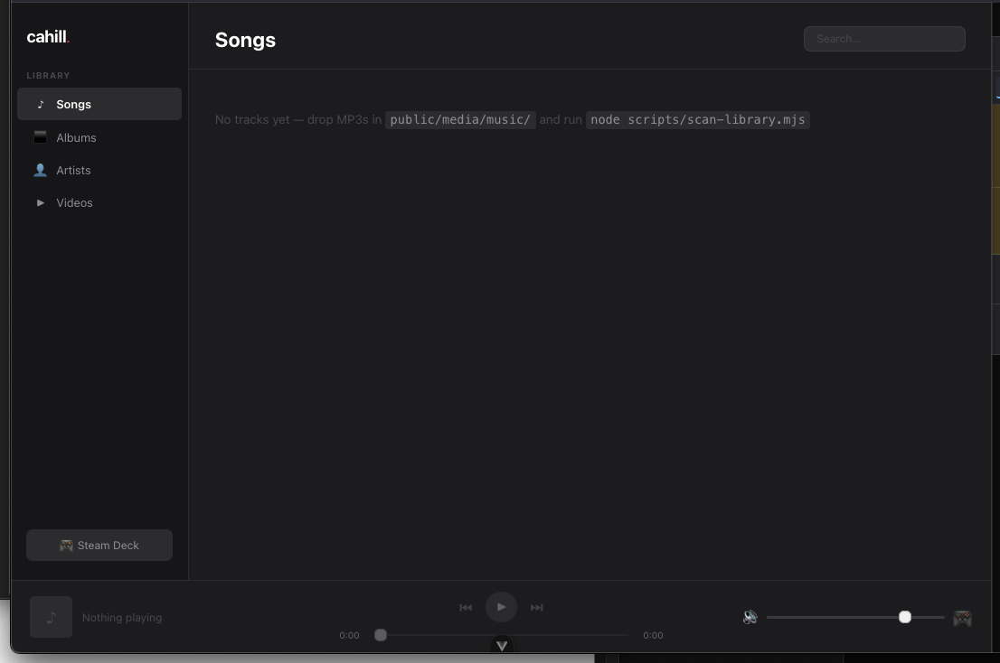

# AWS-based multimedia player

Currently supports dragging and dropping of music files. Video in progress, as well as a chat feature. 

## Adding music to the library

1. Drop files into public/media/music/ — folder structure is respected:
public/media/music/Radiohead/OK Computer/01 - Creep.mp3
2. Run npm run scan-library
3. Refresh the browser — tracks appear instantly

<!--  -->

# upload command 

aws s3 sync /Volumes/ChrisLacie/Music s3://cahill-media-library/music/ --exclude ".*" --only-show-errors 2>&1 | tee ~/music-upload.log